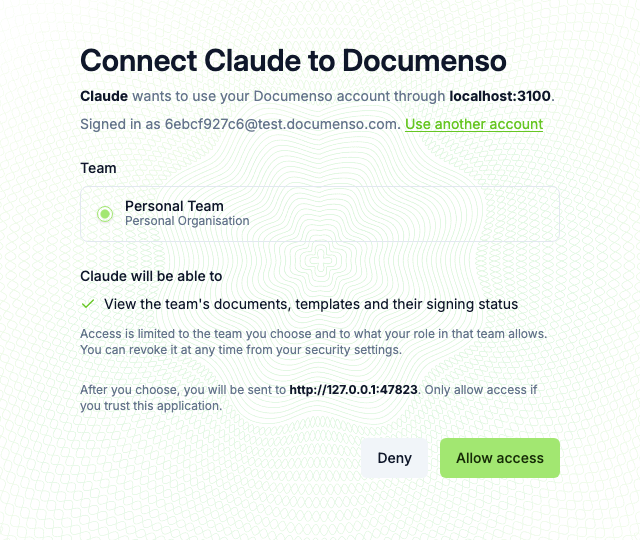
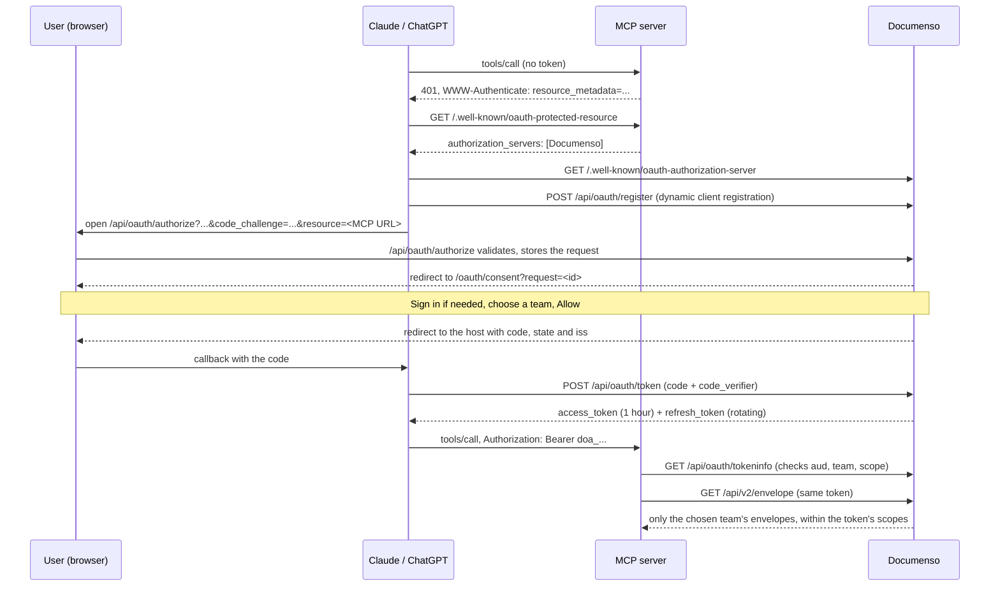

# OAuth 2.1 Authorization Server

> **Fork addition.** This feature exists only in this fork of Documenso. Upstream Documenso does not accept external pull requests, so it has not been proposed there.

Documenso can act as an OAuth 2.1 authorization server, so that AI assistants and other applications can connect to a Documenso account the way they connect to GitHub or ClickUp: the user clicks **Connect**, signs in to Documenso, picks a team, approves what the application may do, and is sent back. Nobody copies an API token.

It was built for [MCP](https://modelcontextprotocol.io) servers such as [documenso-mcp](https://github.com/MohamedBenDaamar/documenso-mcp), which let Claude and ChatGPT work with Documenso documents. It follows the [MCP authorization specification](https://modelcontextprotocol.io/specification/2025-06-18/basic/authorization): dynamic client registration, PKCE, resource indicators and authorization server metadata.

| Consent page | Connected apps (Settings → Security) |
| --- | --- |
|  |  |

## Contents

- [How it works](#how-it-works)
- [Enable it on your instance](#enable-it-on-your-instance)
- [Scopes](#scopes)
- [Endpoints](#endpoints)
- [Tokens](#tokens)
- [Revoking access](#revoking-access)
- [Security design](#security-design)
- [For resource server developers](#for-resource-server-developers)
- [Tests](#tests)
- [Limitations](#limitations)
- [Where the code is](#where-the-code-is)

## How it works



The access token is issued for one user, one team and one resource (the MCP server's URL). Documenso's API v2 accepts it like a team API token, with two differences: it can only call the procedures its [scopes](#scopes) allow, and audit logs record the person who approved it instead of the team.

## Enable it on your instance

The server is **off by default**. Turn it on by listing the MCP servers that tokens may be issued for:

```bash
# .env
NEXT_PRIVATE_OAUTH_RESOURCES="https://mcp.example.com/mcp"
```

- Separate several URLs with commas.
- Each must be `https`, or `http` on `localhost` for development.
- While the variable is empty, `/api/oauth/*` and `/.well-known/oauth-authorization-server` answer `404`.

Apply the database migration (`packages/prisma/migrations/20260929125939_add_oauth_server`) the usual way:

```bash
npm run prisma:migrate-deploy
```

Then point the MCP server at your instance. For documenso-mcp that is its `DOCUMENSO_URL` setting.

## Scopes

Each scope unlocks a fixed list of API v2 procedures (`OAUTH_API_PROCEDURE_SCOPES` in `packages/lib/constants/oauth.ts`). OAuth tokens get `403` on every procedure that is not on the list, whatever their scopes. A new API route is not reachable by OAuth applications until someone adds it there.

| Scope | Shown on the consent page as | API v2 procedures |
| --- | --- | --- |
| `envelopes:read` | View the team's documents, templates and their signing status | `GET /envelope`, `GET /envelope/{id}` |
| `envelopes:write` | Create draft documents from the team's templates | `POST /envelope/use` (without `distributeDocument`) |
| `envelopes:send` | Send documents to recipients for signing | `POST /envelope/distribute`, and `POST /envelope/use` with `distributeDocument: true` |

- A request without any known scope gets `envelopes:read`.
- Unknown scopes such as `openid` or `offline_access` are ignored instead of refused, as [RFC 6749 section 3.3](https://www.rfc-editor.org/rfc/rfc6749#section-3.3) allows. The token response's `scope` says what was granted.
- A token without the required scope gets `403` with `WWW-Authenticate: Bearer error="insufficient_scope", scope="envelopes:send"`. MCP clients use that to send the user back to the consent page for the extra permission (step-up authorization).
- A token can never do more than its user can: the team role and document visibility checks of the regular API still apply.

## Endpoints

| Endpoint | Standard | Purpose |
| --- | --- | --- |
| `GET /.well-known/oauth-authorization-server` | [RFC 8414](https://www.rfc-editor.org/rfc/rfc8414) | Metadata: endpoints, scopes, `S256`, supported client authentication |
| `POST /api/oauth/register` | [RFC 7591](https://www.rfc-editor.org/rfc/rfc7591) | Dynamic client registration |
| `GET /api/oauth/authorize` | [RFC 6749](https://www.rfc-editor.org/rfc/rfc6749#section-4.1.1), [RFC 7636](https://www.rfc-editor.org/rfc/rfc7636), [RFC 8707](https://www.rfc-editor.org/rfc/rfc8707) | Validates the request and redirects to the consent page |
| `GET /oauth/consent` | | Consent page (sign-in, team choice, Allow or Deny) |
| `POST /api/oauth/authorize/decision` | | Called by the consent page only; same-origin |
| `POST /api/oauth/token` | [RFC 6749](https://www.rfc-editor.org/rfc/rfc6749#section-3.2) | `authorization_code` and `refresh_token` grants |
| `POST /api/oauth/revoke` | [RFC 7009](https://www.rfc-editor.org/rfc/rfc7009) | Revokes the grant behind a token |
| `GET /api/oauth/tokeninfo` | [RFC 7662](https://www.rfc-editor.org/rfc/rfc7662#section-2.2) response format | Describes the bearer token: `active`, `sub`, `team_id`, `scope`, `aud`, `exp` |

### Register a client

```bash
curl -X POST https://sign.example.com/api/oauth/register \
  -H 'Content-Type: application/json' \
  -d '{"client_name": "My assistant", "redirect_uris": ["https://assistant.example.com/callback"]}'
```

```json
{
  "client_id": "jjyb77cz2dpmmrqn3qn57s6azp4d5srt",
  "client_id_issued_at": 1790687449,
  "client_name": "My assistant",
  "redirect_uris": ["https://assistant.example.com/callback"],
  "grant_types": ["authorization_code", "refresh_token"],
  "response_types": ["code"],
  "token_endpoint_auth_method": "none"
}
```

Clients that register with `token_endpoint_auth_method` set to `client_secret_post` or `client_secret_basic` also receive a `client_secret` (shown once, stored hashed). PKCE is required for every client either way.

Accepted redirect URIs:

- `https` URLs.
- `http` on `127.0.0.1`, `[::1]` or `localhost`, for desktop apps. The port may change between requests ([RFC 8252 section 7.3](https://www.rfc-editor.org/rfc/rfc8252#section-7.3)).
- Private-use schemes such as `cursor://...`.
- Never: fragments, embedded credentials, or `javascript:`, `data:`, `file:` and similar.

### Authorize

```
GET /api/oauth/authorize
  ?response_type=code
  &client_id=jjyb77cz2dpmmrqn3qn57s6azp4d5srt
  &redirect_uri=https://assistant.example.com/callback
  &code_challenge=E9Melhoa2OwvFrEMTJguCHaoeK1t8URWbuGJSstw-cM
  &code_challenge_method=S256
  &scope=envelopes:read
  &state=af0ifjsldkj
  &resource=https://mcp.example.com/mcp
```

- `resource` must be one of `NEXT_PRIVATE_OAUTH_RESOURCES`. It may be omitted only when exactly one resource is configured.
- An unknown `client_id` or unregistered `redirect_uri` shows an error page and never redirects, because the redirect target cannot be trusted.
- Other errors (missing PKCE, bad resource) redirect back with `error`, `error_description`, `state` and `iss`.
- After approval, the redirect carries `code`, `state` and `iss` ([RFC 9207](https://www.rfc-editor.org/rfc/rfc9207)).

### Exchange the code

```bash
curl -X POST https://sign.example.com/api/oauth/token \
  -d grant_type=authorization_code \
  -d client_id=jjyb77cz2dpmmrqn3qn57s6azp4d5srt \
  -d code=dac_... \
  -d code_verifier=dBjftJeZ4CVP-mB92K27uhbUJU1p1r_wW1gFWFOEjXk \
  -d redirect_uri=https://assistant.example.com/callback \
  -d resource=https://mcp.example.com/mcp
```

```json
{
  "access_token": "doa_...",
  "token_type": "Bearer",
  "expires_in": 3600,
  "refresh_token": "dor_...",
  "scope": "envelopes:read"
}
```

### Refresh

```bash
curl -X POST https://sign.example.com/api/oauth/token \
  -d grant_type=refresh_token \
  -d client_id=jjyb77cz2dpmmrqn3qn57s6azp4d5srt \
  -d refresh_token=dor_...
```

The response contains a new refresh token. The old one stops working.

## Tokens

| Token | Prefix | Lifetime | Notes |
| --- | --- | --- | --- |
| Authorization request | none (32 characters) | 30 minutes | Long enough to sign up or sign in first |
| Authorization code | `dac_` | 5 minutes after approval | Single use |
| Access token | `doa_` | 1 hour | Opaque; checked against the database on every call |
| Refresh token | `dor_` | 30 days | Single use; each refresh returns a new one |
| Client secret | `dcs_` | No expiry | Only for confidential clients |

All secrets are 40 random characters (about 238 bits). The database stores only their SHA-512 hash, so a database leak does not reveal usable tokens.

## Revoking access

| How | Effect |
| --- | --- |
| **Settings → Security → Connected apps → Revoke** | The grant is revoked; its access and refresh tokens fail on their next use |
| `POST /api/oauth/revoke` with either token | Same, for the client that holds the token |
| The user leaves or is removed from the team | Every call checks membership, so the token fails at once and the next refresh revokes the grant |
| A refresh token or code is used twice | Treated as a leak: the whole grant is revoked |
| The user or the organisation owner is disabled | Tokens are refused, as with API tokens |

Access tokens are checked against the database on every request, so revocation takes effect immediately, not when the token expires.

## Security design

| Risk | Mitigation | Where | Test |
| --- | --- | --- | --- |
| Stolen authorization code | PKCE `S256` required; plain challenges refused | `oauth-utils.ts` `verifyPkceS256` | unit + `oauth-server.spec.ts` |
| Replayed code or refresh token | Claimed atomically (`updateMany ... where usedAt is null`); a second use revokes the grant | `exchange-authorization-code.ts`, `refresh-oauth-token.ts` | "an authorization code works once", "refresh tokens rotate" |
| Open redirect | Exact redirect URI match (loopback port excepted); bad client or URI shows an error page instead of redirecting | `authorization-request.ts` | "shows an error page..." |
| Tampered consent parameters | The consent page reads the validated request from the database by ID; the browser only sends the decision and team | `authorization-request.ts` | |
| Cross-site approval (CSRF) | The decision endpoint requires `Origin` to be Documenso (or `Sec-Fetch-Site: same-origin`). The session cookie alone is not enough, since it is `SameSite=None` on https | `api/oauth/route.ts` | "refuses cross-origin posts" |
| Clickjacking the Allow button | The consent page gets `frame-ancestors 'self'` from the app's CSP | `server/security-headers.ts` | manual (response header) |
| Look-alike client names | Control and bidirectional characters stripped; the consent page shows the real redirect host and the MCP server host | `register-client.ts`, `oauth.consent.tsx` | |
| Token used for another team | The team is fixed at consent; approval checks membership; the API ignores `x-team-id` for tokens | `trpc.ts`, `authorization-request.ts` | "a token reaches only the chosen team", "refuses a team the user does not belong to" |
| Scope creep | Procedure allowlist per scope; refresh cannot widen scope; sending on `envelope/use` needs `envelopes:send` | `constants/oauth.ts`, `use-envelope.ts` | "a token with envelopes:send can distribute", "a refresh cannot widen" |
| Token for the wrong audience | `resource` must be configured; `tokeninfo` returns `aud` for the resource server to check | `config.ts` | "refuses resources that are not configured" |
| Tokens reused by another client | Refresh and revocation check `client_id` | `refresh-oauth-token.ts`, `revoke-oauth-token.ts` | "tokens are bound to the client" |
| Oversized or endless request bodies | Hono `bodyLimit` (16 KB), counted while streaming, so a missing `Content-Length` does not bypass it | `api/oauth/route.ts` | |
| Flooding | Per-IP limits: registration 60/h, authorize 120/15 min, token and revoke 300/min, tokeninfo 1000/min; plus the organisation's API limits | `rate-limits.ts` | |
| Database leak | Only SHA-512 hashes of tokens, codes and secrets are stored | `tokens.ts` | |
| Old API surface | API v1 and the download routes do not accept OAuth tokens at all | `get-api-token-by-token.ts` is unchanged | "The v1 API does not accept OAuth tokens" |

## For resource server developers

An MCP server that trusts this Documenso instance should, on each request:

1. Read the bearer token and call `GET /api/oauth/tokeninfo` with it. Cache the answer briefly, for example for 30 seconds, keyed by a hash of the token.
2. Refuse the token unless `active` is `true` and `aud` equals its own resource URL. Otherwise a token issued for another MCP server would be accepted.
3. Call `/api/v2` with the same token. Documenso applies the team, scope and role checks.
4. When Documenso answers `403` with `insufficient_scope`, pass the `WWW-Authenticate` challenge on to the MCP client, so it can ask the user for the extra scope.

```bash
curl https://sign.example.com/api/oauth/tokeninfo -H 'Authorization: Bearer doa_...'
```

```json
{
  "active": true,
  "iss": "https://sign.example.com",
  "sub": "42",
  "client_id": "jjyb77cz2dpmmrqn3qn57s6azp4d5srt",
  "team_id": 7,
  "scope": "envelopes:read",
  "aud": "https://mcp.example.com/mcp",
  "iat": 1790687449,
  "exp": 1790691049,
  "token_type": "Bearer"
}
```

An inactive, expired or revoked token gets `401` with `{"active": false}`. The endpoint only describes the token it is called with, so it reveals nothing to someone who does not already hold that token.

## Tests

| Suite | Command | Covers |
| --- | --- | --- |
| Unit (35 tests) | `npx vitest run server-only/oauth` in `packages/lib` | PKCE (including the RFC 7636 example), redirect URI rules, loopback matching, scope parsing, the procedure allowlist, resource normalisation |
| API end to end (18 tests) | `npm run test:dev -w @documenso/app-tests -- e2e/api/v2/oauth-server.spec.ts` | Metadata, registration rules, authorize errors, CSRF, team membership, code exchange, single-use codes, refresh rotation and reuse detection, scope enforcement on real API calls, revocation, removal from the team, `tokeninfo` |
| Browser end to end (4 tests) | `npm run test:dev -w @documenso/app-tests -- e2e/oauth` | Sign-in redirect and return, consent page content, Allow and Deny, expired requests, Connected apps listing and revoking |

The end-to-end tests need a running instance with `NEXT_PRIVATE_OAUTH_RESOURCES` set; they are skipped otherwise. The CI workflow (`.github/workflows/e2e-tests.yml`) sets it. Run them with `DANGEROUS_BYPASS_RATE_LIMITS=true`, as CI does, or the registration limit trips after a few runs.

## Limitations

- **The API does not check `aud`.** Documenso issued the token, so `/api/v2` accepts it whichever configured resource it was issued for (within its scopes), much as GitHub's API accepts tokens issued for GitHub's MCP server. `aud` protects resource servers from each other; it does not limit what the token can do at Documenso.
- **Consent is asked every time.** Approving the same client again creates a second grant; there is no "remember this app".
- **One team per grant.** To use two teams, connect twice.
- **Access tokens are opaque.** Resource servers need a `tokeninfo` call (cacheable) instead of verifying a JWT locally. In exchange, revocation is immediate.
- **Not yet tested from Claude or ChatGPT.** The flow is covered by the end-to-end tests above, which play the client's part. Connecting a real host needs the MCP server side, which is in progress in documenso-mcp.
- **No client ID metadata documents** ([draft-ietf-oauth-client-id-metadata-document](https://datatracker.ietf.org/doc/draft-ietf-oauth-client-id-metadata-document/)), which newer MCP clients may prefer. Dynamic client registration is implemented instead.
- **Registered clients are never deleted**, and there is no admin page to list them.
- **Sub-path deployments** (`NEXT_PUBLIC_BASE_PATH`) serve metadata at `/<base>/.well-known/...` instead of the RFC 8414 location.
- **English only.** The new strings are extracted into every catalogue but not translated.

## Where the code is

| Area | Files |
| --- | --- |
| Database | `packages/prisma/schema.prisma` (`OAuthClient`, `OAuthAuthorizationRequest`, `OAuthGrant`, `OAuthToken`), migration `20260929125939_add_oauth_server` |
| Constants and scopes | `packages/lib/constants/oauth.ts`, `packages/lib/constants/oauth-translations.ts` |
| Server logic | `packages/lib/server-only/oauth/` |
| HTTP endpoints | `apps/remix/server/api/oauth/route.ts`, metadata in `apps/remix/server/router.ts` |
| API v2 integration | `packages/trpc/server/trpc.ts` (`resolveApiV2Token`), `packages/trpc/server/envelope-router/use-envelope.ts` |
| Consent page | `apps/remix/app/routes/_unauthenticated+/oauth.consent.tsx` |
| Connected apps | `apps/remix/app/routes/_authenticated+/settings+/security.connected-apps.tsx`, `packages/trpc/server/oauth-router/` |
| Tests | `packages/lib/server-only/oauth/oauth-utils.test.ts`, `packages/app-tests/e2e/api/v2/oauth-server.spec.ts`, `packages/app-tests/e2e/oauth/oauth-consent.spec.ts` |
